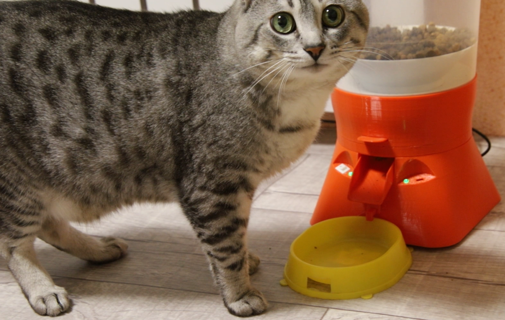
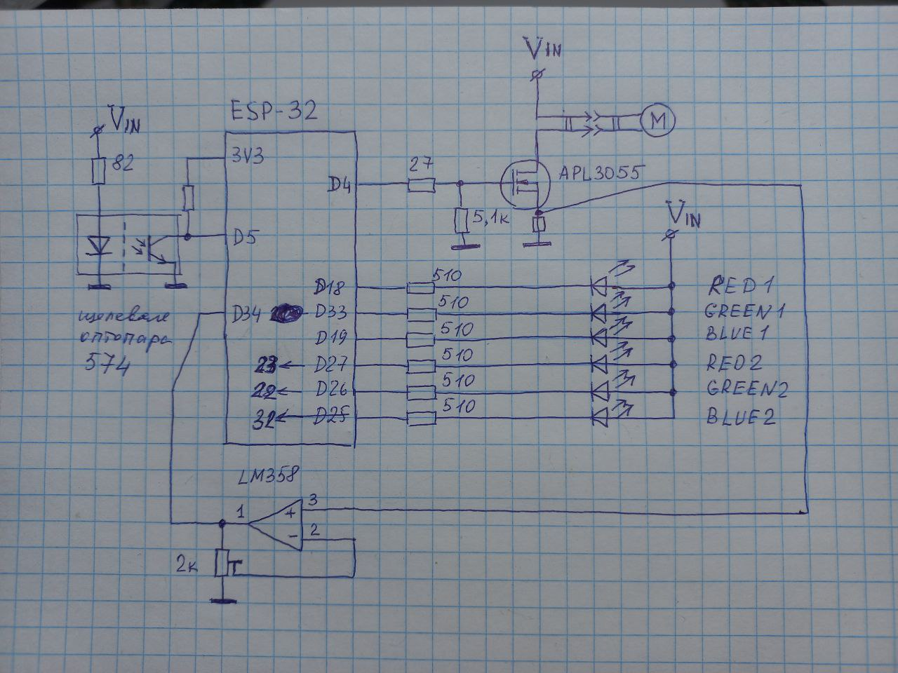

# Автокормушка для кота. ESP-32, WiFi, Bluetooth, расписание.

 - Автоматическая кормушка для домашнего питомца. Не нужно следить за миской кота и контролировать его норму, чтобы он не превратился в колобка, как некоторые домашние питомцы. Экономит время и устраняет одну заботу - помнить о кошачьей миске.

## Возможности

- Не очевидная функция - возможность дрессироваки кота.
- Расписание гибко задается со смартфона через bluetooth.
- Имеет внутренние часы с синхронизацией в интернет, благодаря чему по расписанию выдает корм по норме.
- Имеется педаль экстренной подачи, которую может нажать и сам кот, если научится.
- Так же экстренно можно насыпать корм со смартфона.
- Расписание сохраняется в постоянной памяти и не теряется после отключения питания.
- Емкость контейнера 3 литра в текущем исполнении.
- Имеется защита от застревания корма с попытками протолкнуть.

## Фото устройства

  
*Собранное устройство. И кот!*

## Электрическая схема

  
*Полная электрическая схема*

Подробные файлы схемы:  
- (в планах) ~~[KiCad проект → schematic.kicad_sch](hardware/schematics/)~~
- (в планах) ~~[Экспорт в PDF → schematic.pdf](hardware/schematics/schematic.pdf)~~

## Как открыть и собрать проект

1. Для прошивки микроконтроллера используется Arduino, файл kormushka.ino (файл копируй вместе с папкой, т.к. ардуино требует одноименных названий того и другого). Перед прошивкой внеси данные своей WiFi-сети.
2. Детали кормушки напечатаны на 3д принтере, STL-модели находятся в папке 3Dmodels. ВАЖНО!!! Поскольку это был первый экземпляр, то без мелких ошибок не обошлось, по этому имеются проставки и удлинители. В будущем если проект вызовет интерес, планирую переработать модели, чтобы сборка происходила без лишних телодвижений. В данной версии потребуется не только склейка но и подрезка. Часть деталей изначально задумана из двух половинок, так как напечатать их на принтере целиком крайне не выгодно по филаменту. Проще склеить. Я печатал PETG, он не воняет и легко склеивается дихлорметаном.
3. Радиоэлектроныне компоненты: ESP32, двигатель с редуктором с алиэкспресс JGA25-370 с 16-25 об/мин. 6-12 вольт. Важно, чтобы двигатель давал достаточный момент при напряжении в 5 вольт. Я использовал двигатель с редуктором привода колес от робота-пылесоса на 12 вольт - он такой же, как на али.
4. Полевой ключ APL3055 - любой подобный выдержит ток до 1-2 ампер.
5. Щелевая оптопара тоже дешевая и широкоприменяемая. Я использовал из того-же робота-пылесоса, на ней обозначение 574. Но встречал такие же в принтерах, ксероксах, сканерах и прочих приборах с конечными датчиками-оптопарами.
6. Операционник LM358 так же очень широко распространен.
7. Светодиоды RGB в одном корпусе с общим анодом. На алиэкспресс 50 штук за 120 руб.
8. Резисторы любые. Я паял как прототип на макетке, мне были удобны smd.

## Как использовать

1. Насыпал корм, включил в розетку. Устройство само подключится к WiFi и синхронизирует часы по интернет.
2. В смартфоне открываешь bluetooth-устройства, находишь CatFeeder, подключаешся.
3. Запускаешь любой bluetooth-терминал, коннектишся к выбранному catfeeder-y
4. Список команд 
    **SET 7:15 2** - установить, время в часах:минутах, количество доз. Одна доза = один сектор поворота (из шести). 2 - соответственно два сектора. В моем случае 1 доза это 15 грамм корма. Если поставить 2 то насыплется 30 грамм и так далее. 
    **DEL 7:15** - удалить конкретную запись, если она есть. 
    **LIST** - показать всё расписание 
    **CLEAR** - удалить всё расписание 
    **SAVE** - сохранить расписание в память. ВАЖНО!!! Если не сохранить расписание, то оно пропадет после выключения питания. 
    **RUN** - насыпать одну дозу корма (15гр.) 

## Зависимости / Требования

Для прошивки под линукс открываем терминал, вводим команду *sudo chmod a+rw /dev/ttyACM0* либо *sudo chmod a+rw /dev/ttyUSB0*, чтобы система получила доступ к устройству, то есть задать права доступа. Теперь можно прошивать из ардуино. Как это делается в Windows - расскажите, добавлю сюда. Предполагаю, что понадобится установка драйверов и другие танцы с бубном.

## Disclaimer

Это первая версия readme, в ней обязательно должны быть ошибки и недочеты, по этому обращайтесь по контактам ниже, с вашей помощью устраним баги для будущих посетителей. 

Это рабочий отлаженный прототип. Но пердполагается апгрейд проекта (аккумуляторы, приложение на смартфон, печатная плата с герберами под производство и др.)
Используй на свой страх и риск.  

Сообщения об ошибках / PR приветствуются!

## Лицензия

MIT License — см. файл [LICENSE](LICENSE)

## Контакты

Если хотите со мной связаться: телега *@kahsuist*
